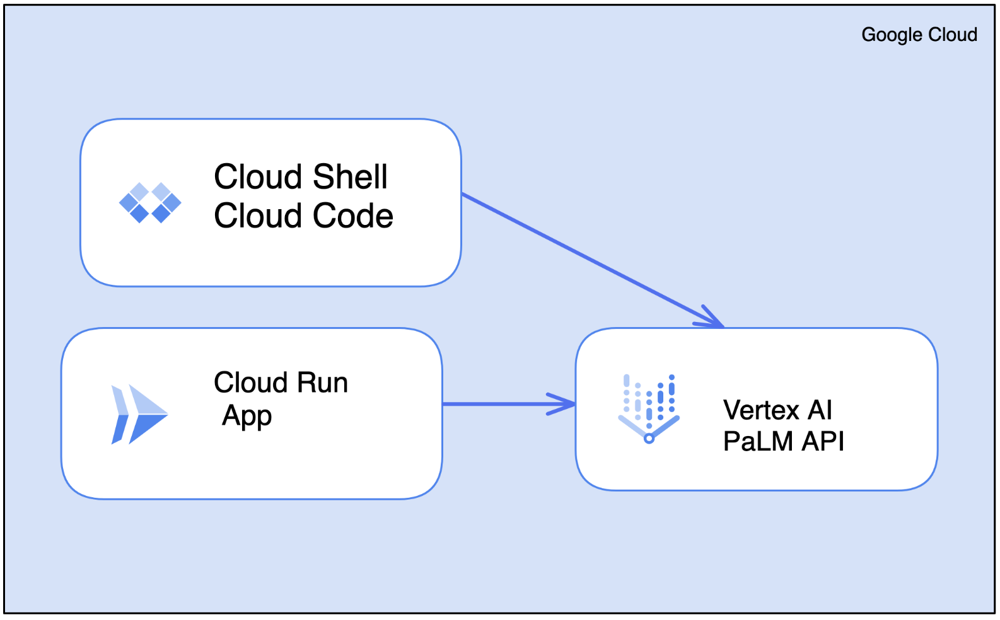
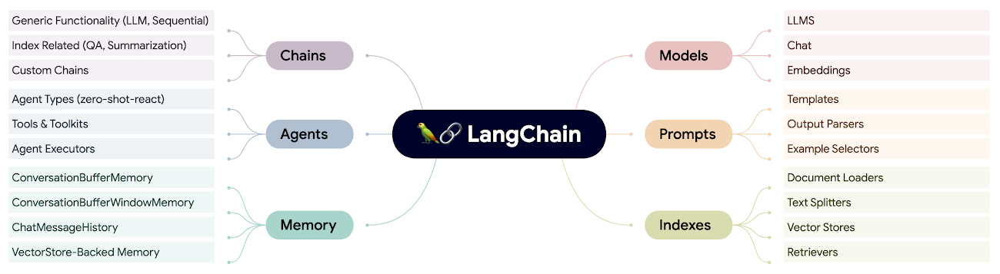
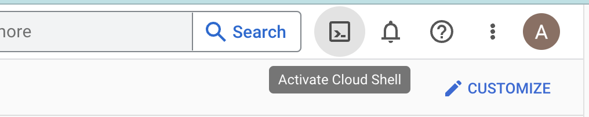
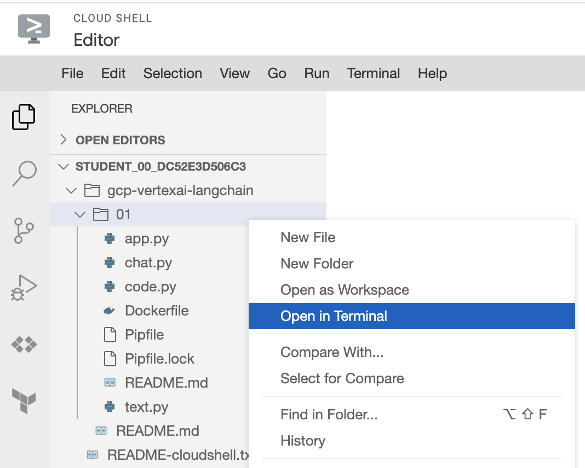
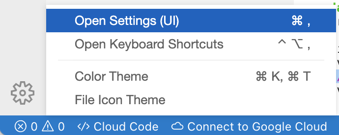
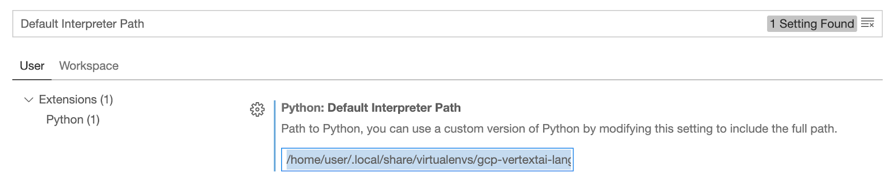
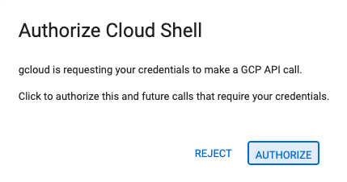
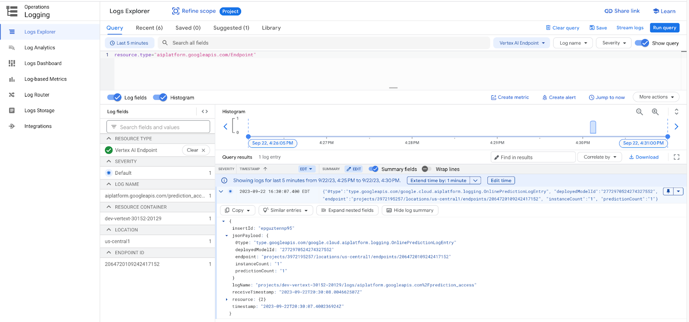

## Developer quickstart with Vertex AI PaLM APIs and LangChain framework

### Overview
In this lab, you will learn how to prepare a GCP project for LLM powered applications and how to use the LangChain framework with Vertex AI PaLM APIs. 

We will start with building and running applications using Cloud Code. 
After that we will deploy applications to Cloud Run.



### What is Vertex AI PaLM API?
Vertex AI gives you access to Google's large generative AI models so you can test, tune, and deploy them for use in your AI-powered applications.

The Vertex AI PaLM API contains the publisher endpoints for Google's Pathways Language Model 2 (PaLM 2), which are large language models (LLMs) that generate text and code in response to natural language prompts. 

PaLM API for text is fine-tuned for language tasks such as classification, summarization, and entity extraction. 

PaLM API for chat is fine-tuned for multi-turn chat, where the model keeps track of previous messages in the chat and uses it as context for generating new responses. 

The Codey APIs include three models that generate code, suggest code for code completion, and let developers chat to get help with code-related questions


### What is LangChain?

LangChain is a framework that enables developers to create applications powered by language models. These applications can be:

- Context-aware: They can connect a language model to sources of context, such as prompt instructions, few shot examples, and content to ground its response in.

- Reasoning: They can rely on a language model to reason about how to answer based on provided context, what actions to take, etc.

The main value propositions of LangChain are:

- Components: Abstractions for working with language models, along with a collection of implementations for each abstraction. Components are modular and easy to use, whether you are using the rest of the LangChain framework or not.

- Off-the-shelf chains: A structured assembly of components for accomplishing specific higher-level tasks.

### LangChain Concepts



### What you will learn
In this lab, you will learn how to do the following:
- How to prepare a GCP project for LLM powered applications
- How to start with LangChain framework and Vertex AI PaLM APIs
- How to write and deploy starter LangChain application to Cloud Run

### Prerequisites
This lab assumes familiarity with the Cloud Console and Cloud Shell environments.

### Environment Setup
Activate Cloud Shell by clicking on the icon to the right of the search bar.



Open Cloud Shell and run commands below. This will launch Cloud Shell Editor:
```shell
git clone https://github.com/gitrey/gcp-vertexai-langchain.git && cd gcp-vertexai-langchain/01

cloudshell edit README.md
```

Right click on 01 folder and select Open in Terminal.



From the top menu select Terminal > New Terminal:

```shell
pip install pipenv --user
```

Set PIPENV_RESOLVER environment variable using path from the previous command output.

Example:
`export PIPENV_RESOLVER=/home/student_00_dc52e3d506c3/.local/bin`

```shell
export PIPENV_RESOLVER=
export PATH=$PATH:$PIPENV_RESOLVER
pipenv install
```
Get current Python interpreter information:

```shell
pipenv --py
```

Sample output

```shell
/home/user/.local/share/virtualenvs/gcp-vertextai-langchain-Hh2gDD7T/bin/python
```
Open Cloud Code Settings and search for “Default Interpreter Path”.



Set the value using output from the previous command and close the Preferences tab.



### Enabling APIs and Authenticate
To use Vertex AI in your project you have configure following items:
- Enable APIs and services
- Authenticate so that you application can make API calls(if running locally)
- Set a quota project, this project will be used for billing and quota limits

To use Vertex AI PALM APIs you will need to enable following service: `aiplatform.googleapis.com`

If you will be running examples outside of Google Cloud Console, you will need to authenticate by running the following command: 
`gcloud auth application-default login`

If you want to use service account instead of your account for API calls use following flag: `--impersonate-service-account`:

`gcloud auth application-default login --impersonate-service-account SERVICE_ACCT_EMAIL`


Set your quota project by running following command:
`gcloud auth application-default set-quota-project $PROJECT_ID`

Run command below in the terminal to enable Vertex AI APIs and set quota project:

```shell
export PROJECT_ID=$(gcloud config get-value project)
gcloud config set project $PROJECT_ID

gcloud services enable aiplatform.googleapis.com

gcloud auth application-default login
gcloud auth application-default set-quota-project $PROJECT_ID
```
 If prompted to authorize, click “Authorize” to continue.



### Models Overview
The three LLM models text-bison, chat-bison, and code-bison are all large language models (LLMs) from Google AI, but they have different strengths and are designed for different use cases.

Text-bison is a general-purpose LLM that can be used for a variety of tasks, including text generation, translation, and question answering. It is trained on a massive dataset of text and code, and can generate text in a variety of creative formats, like poems, code, scripts, musical pieces, email, letters, etc. It can also translate between languages and answer your questions in an informative way.

Chat-bison is a fine-tuned version of text-bison that is specifically designed for chat conversations. It is trained on a dataset of human conversations, and can generate more natural and engaging responses than text-bison. Chat-bison is ideal for text tasks about code that require back-and-forth interactions.

Code-bison is a fine-tuned version of text-bison that is specifically designed for programming tasks. It is trained on a dataset of code and documentation, and can generate code, translate between programming languages, and answer programming-related questions. Code-bison is ideal for tasks such as code generation, code translation, and code debugging.

#### Which model should you use?

The best model for you will depend on your specific needs. If you need a general-purpose LLM, then text-bison is a good choice. If you need a model for chat conversations, then chat-bison is a better choice. And if you need a model for programming tasks, then code-bison is the best choice.

Here are some examples of how you might use each model:
- Text-bison: Write a poem about a cat, translate a document from English to Spanish, answer the question "What is the capital of France?"
- Chat-bison: Have a conversation with a user about how to debug a piece of code, help a user brainstorm ideas for a new software project, provide support to a user who is having trouble with a product.
- Code-bison: Generate code to implement a new algorithm, translate code from Python to Java, debug a piece of code.


### PaLM API for text
Open `text.py` file from the file explorer and review the code.
In this example we set up the prompt with instructions to provide step by step reasoning to generate the answer.

Run the application by clicking the green play button in the top right corner or by right clicking and selecting `Run Python File in Terminal`. Review program output:

```shell
 We started with 10 books. 
We gave 2 books to student A. 10 - 2 = 8 books left. 
We gave 4 books to student B. 8 - 4 = 4 books left. 
We can give 4 books to student C. 
The answer: 4
```
Change the question/input and re-run the application.

### PaLM API for chat
Open `chat.py` file from the file explorer and review the code.
In this example we set up the prompt with instructions to translate the user's input from English to Italian.

Run the application by clicking the green play button in the top right corner or by right clicking and selecting Run `Python File in Terminal`. Review program output:

```shell
Questo è un assistente utile che può tradurre dall'inglese all'italiano.
```
Change the question/input and re-run the application.


### PaLM API for code
Open `code.py` file from the file explorer and review the code.
In this example we ask the model to explain a piece of code.

Run the application by clicking the green play button in the top right corner or by right clicking and selecting `Run Python File in Terminal`. Review program output:

```shell
The code you provided creates an instance of the Vertex AI Language Model (LLM) class,
which is a Python client library for interacting with the Vertex AI Language service.
The LLM class provides a convenient way to access the service's language models and perform various language-related tasks,
such as text generation, translation, and sentiment analysis.
.
.
```

Change the question/input and re-run the application.

### Review logs 
Review logs in the [Logs Explorer](https://console.cloud.google.com/logs/query;query=resource.type%3D%22aiplatform.googleapis.com%2FEndpoint%22) by searching for `resource.type="aiplatform.googleapis.com/Endpoint"`. From the logs you can see that the text-bison model is being used.



### Run local web server with Flask
In the terminal window, switch to `qwiklabs-gcp-...` tab and run following command to start the application:

```shell
pipenv shell

flask --app app run --port 8080
```

Sample output:
```shell
01) student_00_dc52e3d506c3@cloudshell:~/gcp-vertexai-langchain/01 (qwiklabs-gcp-00-82c494360f3a)$ flask --app app run --port 8080
 * Serving Flask app 'app'
 * Debug mode: off
WARNING: This is a development server. Do not use it in a production deployment. Use a production WSGI server instead.
 * Running on http://127.0.0.1:8080
Press CTRL+C to quit
```

Open another terminal tab and send the request to `/text` endpoint:

```shell
curl -X GET -G http://127.0.0.1:8080/text --data-urlencode 'query=benefits of Vertex AI'
```

Sample output:
```shell
Vertex AI can help you accelerate time to insights with AutoML and end-to-end MLOps. 
With AutoML you can build models faster with minimal manual effort. 
Vertex AI provides pre-trained models and reference architectures for common use cases. 
Vertex AI provides MLOps capabilities to manage your machine learning models throughout their lifecycle.
```
Send the request to `/chat` endpoint:
```shell
curl -X GET -G http://127.0.0.1:8080/chat --data-urlencode 'query=benefits of Vertex AI'
```

```shell
vantaggi di Vertex AI.
```

Send the request to `/code` endpoint:
```shell
curl -X GET -G http://127.0.0.1:8080/code --data-urlencode 'query=write a function to print env variables in Java'
```
Sample output:
```java
import java.util.Map;

public class PrintEnvVariables {

    public static void main(String[] args) {
        Map<String, String> env = System.getenv();
        for (String envName : env.keySet()) {
            System.out.println(envName + "=" + env.get(envName));
        }
    }
}
```

### Deploy application to Cloud Run

In this section you will deploy this application to Cloud Run.
Switch to the tab where you have the Flask application running and press Ctrl+C to stop it.

Run commands to create a new service account and enable APIs.

```shell
gcloud iam service-accounts create genaiapp-sa-cr \
    --display-name="Cloud Run Service Account for GenAI App"

gcloud services enable artifactregistry.googleapis.com
gcloud services enable cloudbuild.googleapis.com
gcloud services enable run.googleapis.com
```
Grant Vertex AI User role to the service account. More details about Vertex AI permission - IAM page.
```shell
gcloud projects add-iam-policy-binding $PROJECT_ID \
    --member="serviceAccount:genaiapp-sa-cr@$PROJECT_ID.iam.gserviceaccount.com" \
    --role="roles/aiplatform.user"
```
Deploy application:
```shell
gcloud run deploy genai-app \
  --region=us-central1 \
  --source . \
  --allow-unauthenticated \
  --service-account=genaiapp-sa-cr@$PROJECT_ID.iam.gserviceaccount.com
```
Answer `yes` to continue when prompted about Artifact Registry repository creation.

Wait for deployment to complete. Sample output:


```shell
Service [genai-app] revision [genai-app-00001-p58] has been deployed and is serving 100 percent of traffic.
Service URL: https://genai-app-flmu5loyxa-uc.a.run.app
```

Copy service URL from previous command and set APP_URL environment variable.

Example: `export APP_URL=https://genai-app-flmu5loyxa-uc.a.run.app`

Send the request to `/text` endpoint. 

```shell
curl -X GET -G "$APP_URL/text" --data-urlencode 'query=benefits of Cloud Run'
```

Send the request to /chat endpoint. 
```shell
curl -X GET -G "$APP_URL/chat" --data-urlencode 'query=A cup of coffee would be nice right now'
```
Send the request to /code endpoint. 
```shell
curl -X GET -G "$APP_URL/code" --data-urlencode 'query=write a gcloud command to list cloud run services'
```

### Congratulations!

Congratulations, you finished the codelab!

What we’ve covered:

- How to prepare a GCP project for LLM powered applications
- How to start with LangChain framework and Vertex AI PaLM APIs
- How to write and deploy starter LangChain application to Cloud Run

What’s next:

Explore other codelabs in this series:

- [Using Vertex AI Embeddings for text to ground LLM on your custom data](./02)
